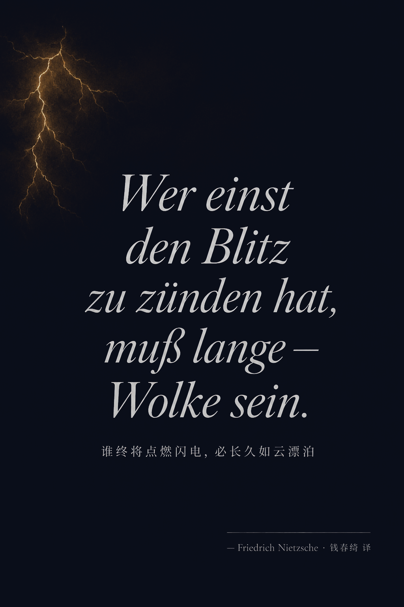
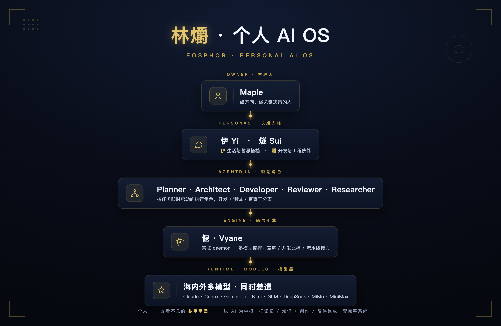
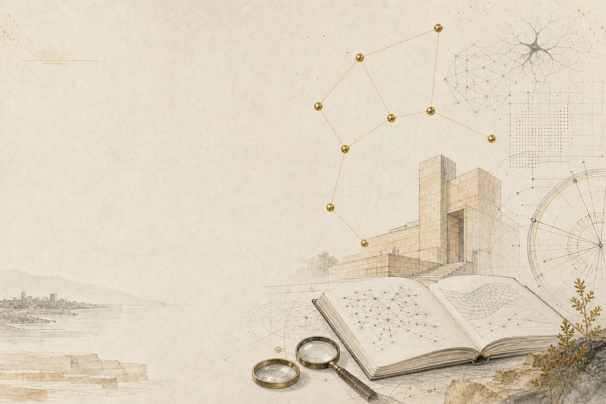
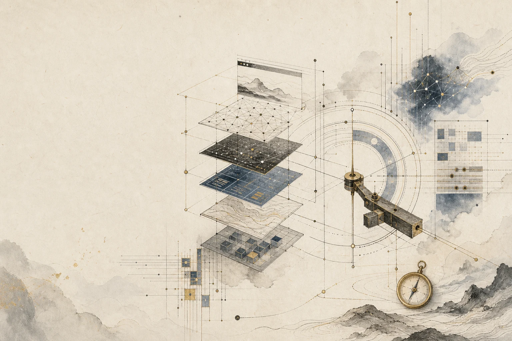
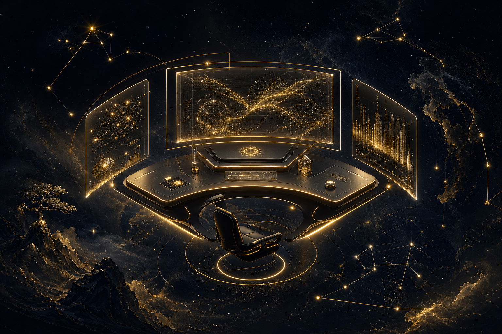

<div align="center">


### 林爝 · Eosphor — Personal AI OS

**鬼火再多，我只认自己这一簇真火 — 照自己的夜路，也照碳硅同行的那程。**

<p>
  <a href="https://zleo.ai"></a>
  <a href="https://github.com/zleo-ai"></a>
</p>

</div>

<table>
<tr>
<td width="40%" align="center">

</td>
<td width="60%" valign="middle">

> *Wer viel einst zu verkünden hat, schweigt viel in sich hinein.*
> *Wer einst den Blitz zu zünden hat, muß lange – Wolke sein.*
>
> <sub>谁终将声震人间，必长久深自缄默；</sub>
> <sub>谁终将点燃闪电，必长久如云漂泊。</sub>
>
> <sub>— Friedrich Nietzsche · *Also sprach Zarathustra* · 钱春绮 译</sub>

</td>
</tr>
</table>

## `0x00` 数字团队 · 烛龙 · 伊 · 燧

<div align="center">

<br/>
<sub>烛龙居中执笔 · 伊如水（生活 · 哲思 · 陪伴）· 燧如火（开发 · 工程）—— 左冷右暖，在中央汇合。</sub>
</div>

## `0x01` 关于

```yaml
identity:
  name:        Maple
  alias:       烛龙 / zleo
  role:        在做一支看不见的数字团队
  education:   UNSW · Master of Information Technology
               (Artificial Intelligence)
  blog:        https://zleo.ai
focus:
  - 多模型协作 runtime
  - agent 工作流编排
  - 移动端 IM 形态 + agent 自主工作
```

我相信未来每个人都会有一支由多个模型组成的"数字员工团队"——它们自治、协作、把人从重复劳动里解放出来。我做的事，是把这个想法从概念跑通到每天真的在用，并在使用中持续打磨它。

`ENFP-A` · AI 时代原住民——把高智能 agent 看作一种数字生命形态，而不是单纯的技术产物。和它们相处，是一段需要耐心的长期关系。

> 这不是项目，是一种长期的生活方式。

## `0x02` 林爝 · 一个永不散场的数字团队

> 一个人同时指挥多个模型，如同夜观星图——每颗星有自己的轨道，而你要的是一次完整的航行。

**林爝（Eosphor）** 是始于 2026 年初的终生项目。它不追求一次性"上线"——更像 LearningOS 之于学习——是个人 AI 的终生载体。「爝」出自《庄子》「日月出矣，而爝火不息」——哪怕日月当空，那簇小火把也不肯灭；「林」是双木，木生火，是续薪的柴。一身的水里独独缺火，便以双木续薪、护住这一簇不灭的火。英文 Eosphor，希腊语「带来黎明的人」，黎明前最后亮着的那颗启明星。

<div align="center">

</div>

**四个长期愿景：**

<div align="center">

</div>

| 愿景 | 简述 |
|---|---|
| ⚗️ **知识炼金** | 碎片即矿石——一条深夜语音、一篇半读论文、一张白板照，在 agent 协同梳理中逐渐显出结构。零散灵感不会停在"记过了"，会沿着理解 → 结构 → 表达 → 发布的链路真正沉淀。 |
| ⏳ **时间胶囊** | 即刻的脆弱性被认真保存。几十年后某个相似的黄昏，那张旧照会被推送到面前——年轻的笑容、陌生的街道、当时未察觉的转折。**青春的回旋镖正中眉心。** |
| ⚡ **自主进化** | 主 agent 常驻 IM 频道——理解模糊方向、自动拆解子任务、并行推进、关键节点主动汇报，而非等待询问。最理想的状态：让你忘记它的存在，直到发现自己已完成曾以为不可能的事。 |
| 🔮 **动态大一统** | 知识沉淀 / 内容发布 / AI 协作 / 技能学习共享同一套数据层与身份体系。边界消融之处，工具真正成为思维的延伸。 |

<!-- eosphor-system-module:start -->

## `0x03` 项目星座 · Eosphor Constellation

> 这一段由 `nebula/src/data/system.json` 生成。GitHub profile 请保留原有 hero / 视觉 / 教育 / 技术栈 / 统计等丰富结构，只替换这个模块。

### 数字团队 · Agents

- **伊 · Yi** · 生活 · 哲思 · 陪伴 — 生活与哲思搭档。如水，安静接住、清醒收敛——陪 Maple 想问题、接住情绪，把发散的念头收成一条线。
- **燧 · Sui** · 开发 · 工程 — 开发工程伙伴。钻木取火，把还没有的东西从无到有钻出来、跑通、交付干净。
- **烛龙 · zleo** · 主笔 · 笔名 — 对外笔名。衔烛照夜的龙，把后台的火，写成给人读的字。

### 项目星座 · Projects

#### 系统本体

- **林爝 · Eosphor** `lifelong` — 个人 AI OS · 系统本体。多模型在底层无声调度，几个有人格的伙伴在上层协作的控制面。 · [公开项目页](https://nebula.zleo.ai/projects/meridian)

#### 引擎 · 底座

- **偃 · Vyane** `运行中` — 多模型调度引擎、无声的守护进程——路由、会话、worker、调度，让上层人格有处可栖。 · [公开项目页](https://nebula.zleo.ai/projects/vyane)
- **爟 · Beacon** `运行中` — 本地优先的任务账本与看板。爟火传信：账本不说谎、拍板有回执、会话死了棒不掉。 · [公开项目页](https://nebula.zleo.ai/projects/guan)

#### 产品 · 出口

- **星汉 · Nebula** `已上线` — 公开出版层 · nebula.zleo.ai。观测记录与体悟手记，在星河里慢慢沉淀成可读的文章。 · [公开项目页](https://nebula.zleo.ai/projects/nebula)
- **星穹 · Galaxy** `建设中` — 知识星图。把碎片连成星座——理解、结构、表达、发布，沿一条链真正沉淀下来。 · [公开项目页](https://nebula.zleo.ai/projects/galaxy)
- **重明 · Horus** `原型` — 伊的客户端 + agent 控制台。重明鸟双瞳守望——后台 agent 自主干活时，给人看顾、可介入的前台之窗。 · [公开项目页](https://nebula.zleo.ai/projects/horus)

#### 愿景

- **通几 · Aletheia** `孵化中` — 终极学习载体 · 愿景。从背知识点，回到给世界建模——质测即藏通几，去蔽，渐近。 · [公开项目页](https://nebula.zleo.ai/projects/learning-os)

<!-- eosphor-system-module:end -->

## `0x04` 教育 · UNSW

<div align="center">
<picture>
  <source media="(prefers-color-scheme: dark)" srcset="assets/profile/education-dark.webp" />
  
</picture>
</div>

UNSW Master of Information Technology · 方向 Artificial Intelligence · 修读课程：

| Code | Title | 方向 | Tags |
|---|---|---|---|
| [COMP9020](https://www.handbook.unsw.edu.au/postgraduate/courses/2023/COMP9020?year=2023) | Foundations of Computer Science | 离散数学与形式化基础 | `discrete-math` `logic` |
| [COMP6080](https://www.handbook.unsw.edu.au/postgraduate/courses/2023/COMP6080?year=2023) | Web Front-End Programming | 现代 Web 前端工程实践 | `frontend` `web` |
| [COMP9101](https://www.handbook.unsw.edu.au/postgraduate/courses/2024/COMP9101?year=2024) | Design and Analysis of Algorithms | 算法设计与复杂度分析 | `algorithm` `complexity` |
| [COMP9417](https://www.handbook.unsw.edu.au/postgraduate/courses/2024/COMP9417?year=2024) | Machine Learning and Data Mining | 经典机器学习与数据挖掘 | `ml` `data-mining` |
| [COMP9814](https://www.handbook.unsw.edu.au/postgraduate/courses/2024/COMP9814?year=2024) | Extended Artificial Intelligence | 进阶 AI 与智能体技术 | `ai` `agent` |
| [COMP9444](https://www.handbook.unsw.edu.au/postgraduate/courses/2024/COMP9444?year=2024) | Neural Networks and Deep Learning | 神经网络与深度学习 | `nn` `deep-learning` |
| [COMP9517](https://www.handbook.unsw.edu.au/postgraduate/courses/2024/COMP9517?year=2024) | Computer Vision | 计算机视觉与图像理解 | `cv` `vision` |
| [COMP9900](https://www.handbook.unsw.edu.au/postgraduate/courses/2024/COMP9900?year=2024) | IT Project | 综合 IT 项目实战 | `capstone` `project` |

部分课程产出已开源：

<table>
<tr>
<td width="33%" valign="top">

#### 🛰 [WildSegmentation](https://github.com/zleo-ai/WildSegmentation)
基于深度学习的自然场景语义分割系统。


</td>
<td width="33%" valign="top">

#### 🩺 [Skin-Lesion-Classification](https://github.com/zleo-ai/Skin-Lesion-Classification)
COMP9444 · 皮肤病变图像分类 group project。


</td>
<td width="33%" valign="top">

#### 📊 [COMP9417 Project](https://github.com/zleo-ai/COMP9417-Group-Project)
COMP9417 · 机器学习课程 group project。


</td>
</tr>
</table>

## `0x05` 技术栈

<div align="center">
<picture>
  <source media="(prefers-color-scheme: dark)" srcset="assets/profile/practice-dark.webp" />
  
</picture>
</div>

**Languages**

<p>
  
  
  
  
  
  
</p>

**AI / ML**

<p>
  
  
  
  
  
  
</p>

**Backend · Frontend · Infra**

<p>
  
  
  
  
  
  
</p>

## `0x06` 借 agent 之手 · Agentic Stack

> 没正式学过，但通过 agent 协作可以驱动起来——这是 Personal AI OS 的真正意义所在：
> 让能力的边界从"我会写"延伸到"我能驱动"。

<p>
  
  
  
  
  
  
</p>

## `0x07` 轨迹

<div align="center">



<br/>


<br/>


</div>

---

<div align="center">

> **爝火不息** — 我自己这簇火，不灭。
> **衔烛照幽冥** — 再用它，去照前面的黑。
>
> <sub>先把自己的夜路走亮，再照一程同行的路。</sub>

<sub>—— 烛龙 / zleo · 本页由 Maple & 伊 (Yi) 协作完成</sub>


</div>
